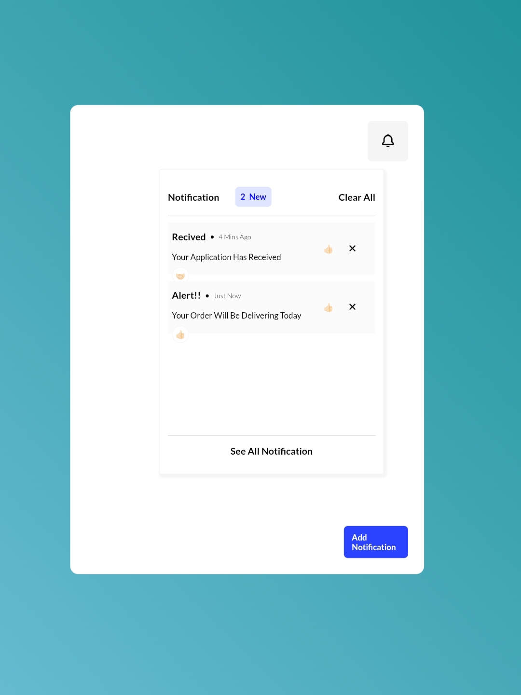

# Notification Rendering 

Notification rendering UI component works as a service to the end user for enabling feedback or requests.  Here is a basic implementation of a notification rendering component used for web components.

## How to Implement?

1. To add notification content for the user, click the "Add Notifications" button located below the notification container. 
2. Click on the notification to see a flashing animation of the number (indicating the number of notifications you added) in the upper right corner of the notification icon box.
3. There is also an emoji box that allows you to react by clicking any emoji.
4. You can remove or clear all notifications.

## Screenshot

Here is the output of the component :

## Live preview of webpage

[Live Preview](https://Hayatiiii.github.io/UI-Components/#1%20Notification-Rendering/Index.html)
